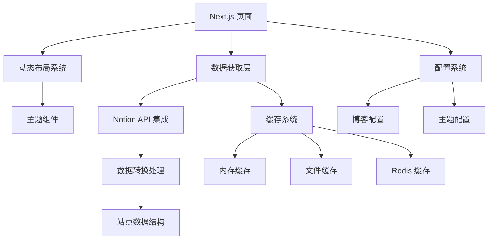

# NotionNext 代码结构分析报告

## 1. 整体项目架构分析

### 1.1 项目概览

NotionNext 是一个基于 Next.js 的静态站点生成器，利用 Notion 作为内容管理系统，支持多种主题和丰富的功能扩展。

### 1.2 目录结构

| 目录/文件 | 功能描述 |
|---------|--------|
| `components/` | 通用 UI 组件，包括评论、搜索、分析等功能组件 |
| `conf/` | 配置文件目录，包含评论、联系、文章、分析等配置 |
| `lib/` | 核心库和工具函数，包括缓存、数据库、工具等 |
| `pages/` | Next.js 页面路由，包含 API 路由和页面组件 |
| `public/` | 静态资源文件，包括图片、CSS、JS 等 |
| `themes/` | 主题系统，包含多种预设主题 |
| `styles/` | 全局样式文件 |
| `scripts/` | 开发和构建脚本 |
| `blog.config.js` | 主配置文件 |
| `next.config.js` | Next.js 配置文件 |

### 1.3 核心模块关系



## 2. 核心功能模块解析

### 2.1 Notion API 集成

**功能说明**：通过 Notion API 获取页面数据，转换为网站可用的格式。

**实现逻辑**：
- 使用 `notion-client` 和 `notion-utils` 库与 Notion API 交互
- 通过 `SiteDataApi.js` 中的 `fetchGlobalAllData` 函数获取全站数据
- 支持多语言页面配置
- 数据处理流程：获取原始数据 → 标准化处理 → 转换为站点数据结构

**关键文件**：
- `lib/db/SiteDataApi.js`：站点数据获取和处理的核心
- `lib/db/notion/`：Notion 数据处理的具体实现

### 2.2 主题系统

**功能说明**：支持多种预设主题，可动态切换。

**实现逻辑**：
- 主题定义在 `themes/` 目录下，每个主题有独立的组件和配置
- 通过 `themes/theme.js` 实现主题的动态加载和切换
- 支持通过 URL 参数临时切换主题
- 主题组件采用模块化设计，便于扩展

**关键文件**：
- `themes/theme.js`：主题加载和管理
- `themes/[theme]/`：各主题的具体实现

### 2.3 缓存系统

**功能说明**：减少 Notion API 请求，提高站点性能。

**实现逻辑**：
- 支持三种缓存方式：内存缓存、文件缓存、Redis 缓存
- 通过 `cache_manager.js` 统一管理缓存操作
- 缓存键值基于数据类型和 ID 生成
- 构建时预缓存数据，运行时优先从缓存获取

**关键文件**：
- `lib/cache/cache_manager.js`：缓存管理核心
- `lib/cache/memory_cache.js`：内存缓存实现
- `lib/cache/local_file_cache.js`：文件缓存实现
- `lib/cache/redis_cache.js`：Redis 缓存实现

### 2.4 多语言支持

**功能说明**：支持多语言站点配置。

**实现逻辑**：
- 在 `blog.config.js` 中配置默认语言
- 通过 `NOTION_PAGE_ID` 配置多语言页面 ID，格式为 `xxx,zh:xxx,en:xxx`
- Next.js 多语言路由支持
- 语言切换通过 URL 前缀实现

**关键文件**：
- `next.config.js`：多语言路由配置
- `lib/utils/pageId.js`：语言前缀提取

### 2.5 评论系统

**功能说明**：集成多种第三方评论系统。

**实现逻辑**：
- 在 `conf/comment.config.js` 中配置评论系统
- 支持 Giscus、Utterances、Disqus、Valine、Waline 等
- 通过组件化方式集成到页面中

**关键文件**：
- `components/Comment.js`：评论组件集成
- `conf/comment.config.js`：评论系统配置

## 3. 数据流程梳理

### 3.1 页面数据获取流程

1. **初始化请求**：用户访问页面时，Next.js 触发 `getStaticProps` 或 `getServerSideProps`
2. **数据获取**：调用 `fetchGlobalAllData` 获取全站数据
3. **缓存检查**：通过 `getOrSetDataWithCache` 检查缓存
4. **API 请求**：如果缓存未命中，调用 Notion API 获取数据
5. **数据转换**：将 Notion 原始数据转换为站点数据结构
6. **数据处理**：处理文章、分类、标签等数据
7. **页面渲染**：将处理后的数据传递给页面组件
8. **静态生成**：构建时生成静态页面，运行时按需更新

### 3.2 文章页面数据流程

1. **路径解析**：解析 URL 中的前缀、slug 和后缀
2. **全局数据获取**：获取全站数据作为基础
3. **文章匹配**：根据 slug 或 ID 匹配文章
4. **内容获取**：获取文章的完整内容块
5. **数据处理**：处理文章内容，包括图片、链接等
6. **页面渲染**：渲染文章页面，包括标题、内容、评论等

### 3.3 主题数据流程

1. **主题选择**：根据配置或 URL 参数选择主题
2. **主题加载**：动态导入主题组件
3. **布局渲染**：使用主题的布局组件渲染页面
4. **样式应用**：应用主题的样式
5. **组件渲染**：渲染主题的各个组件

## 4. 技术栈与依赖说明

### 4.1 核心技术

| 技术/框架 | 版本 | 用途 | 来源 |
|---------|------|------|------|
| Next.js | ^14.2.30 | 静态站点生成框架 | package.json |
| React | ^18.3.1 | UI 库 | package.json |
| Tailwind CSS | ^3.4.17 | 样式框架 | package.json |
| Notion API | - | 内容管理系统 | notion-client, notion-utils |
| TypeScript | 5.6.2 | 类型检查 | package.json |

### 4.2 关键依赖

| 依赖 | 版本 | 用途 | 来源 |
|------|------|------|------|
| notion-client | 7.7.1 | Notion API 客户端 | package.json |
| notion-utils | 7.7.1 | Notion 工具函数 | package.json |
| react-notion-x | 7.7.1 | Notion 内容渲染 | package.json |
| ioredis | ^5.6.1 | Redis 客户端 | package.json |
| memory-cache | ^0.2.0 | 内存缓存 | package.json |
| algoliasearch | ^4.25.2 | 全文搜索 | package.json |
| @vercel/analytics | ^1.5.0 | 站点分析 | package.json |

### 4.3 开发工具

| 工具 | 版本 | 用途 | 来源 |
|------|------|------|------|
| ESLint | ^8.57.1 | 代码质量检查 | package.json |
| Prettier | ^3.6.2 | 代码格式化 | package.json |
| Jest | ^29.7.0 | 单元测试 | package.json |
| next-sitemap | ^1.9.12 | 站点地图生成 | package.json |

## 5. 关键代码片段解读

### 5.1 站点数据获取

```javascript
// lib/db/SiteDataApi.js:42-74
export async function fetchGlobalAllData({ pageId = BLOG.NOTION_PAGE_ID, from, locale }) {
  // 获取站点数据 ， 如果pageId有逗号隔开则分次取数据
  const siteIds = pageId?.split(',') || []
  let data = EmptyData(pageId)

  if (BLOG.BUNDLE_ANALYZER) {
    return data
  }

  try {
    for (let index = 0; index < siteIds.length; index++) {
      const siteId = siteIds[index]
      const id = extractLangId(siteId)
      const prefix = extractLangPrefix(siteId)
      // 第一个id站点默认语言
      if (index === 0 || locale === prefix) {
        data = await getSiteDataByPageId({ pageId: id, from })
      }
    }
  } catch (error) {
    console.error('异常', error)
  }

  // 返回给客户端前的清理操作
  return handleDataBeforeReturn(deepClone(data))
}
```

**解读**：
- 支持多语言站点配置，通过逗号分隔不同语言的页面 ID
- 优先获取默认语言或指定语言的数据
- 异常处理确保站点在 API 错误时仍能正常运行
- 返回前清理数据，减少传输体积

### 5.2 缓存管理

```javascript
// lib/cache/cache_manager.js:19-52
export async function getOrSetDataWithCache(key, getDataFunction, ...getDataArgs) {
  return getOrSetDataWithCustomCache(key, null, getDataFunction, ...getDataArgs)
}

export async function getOrSetDataWithCustomCache(key, customCacheTime, getDataFunction, ...getDataArgs) {
  const dataFromCache = await getDataFromCache(key)
  if (dataFromCache) {
    // console.log('[缓存-->>API]:', key) // 避免过多的缓存日志输出
    return dataFromCache
  }
  const data = await getDataFunction(...getDataArgs)
  if (data) {
    // console.log('[API-->>缓存]:', key)
    await setDataToCache(key, data, customCacheTime)
  }
  return data || null
}
```

**解读**：
- 缓存优先策略，减少 API 请求
- 支持自定义缓存时间
- 缓存未命中时调用数据获取函数
- 数据获取成功后自动写入缓存

### 5.3 主题加载

```javascript
// themes/theme.js:80-84
export const DynamicLayout = props => {
  const { theme, layoutName } = props
  const SelectedLayout = useLayoutByTheme({ layoutName, theme })
  return <SelectedLayout {...props} />
}

// themes/theme.js:92-117
export const useLayoutByTheme = ({ layoutName, theme }) => {
  const LayoutComponents = ThemeComponents[layoutName] || ThemeComponents.LayoutSlug

  const router = useRouter()
  const themeQuery = getQueryParam(router?.asPath, 'theme') || theme
  const isDefaultTheme = !themeQuery || themeQuery === BLOG.THEME

  // 加载非当前默认主题
  if (!isDefaultTheme) {
    const loadThemeComponents = componentsSource => {
      const components = componentsSource[layoutName] || componentsSource.LayoutSlug
      setTimeout(fixThemeDOM, 500)
      return components
    }
    return dynamic(
      () => import(`@/themes/${themeQuery}`).then(m => loadThemeComponents(m)),
      { ssr: true }
    )
  }

  setTimeout(fixThemeDOM, 100)
  return LayoutComponents
}
```

**解读**：
- 支持通过 URL 参数临时切换主题
- 动态导入主题组件，减少初始加载体积
- 服务端渲染支持，确保首屏性能
- 主题切换时的 DOM 修复，确保页面正确显示

### 5.4 页面数据解析

```javascript
// pages/index.js:25-86
export async function getStaticProps(req) {
  const { locale } = req
  const from = 'index'
  const props = await fetchGlobalAllData({ from, locale })
  const POST_PREVIEW_LINES = siteConfig(
    'POST_PREVIEW_LINES',
    12,
    props?.NOTION_CONFIG
  )
  props.posts = props.allPages?.filter(
    page => page.type === 'Post' && page.status === 'Published'
  )

  // 处理分页
  if (siteConfig('POST_LIST_STYLE') === 'scroll') {
    // 滚动列表默认给前端返回所有数据
  } else if (siteConfig('POST_LIST_STYLE') === 'page') {
    props.posts = props.posts?.slice(
      0,
      siteConfig('POSTS_PER_PAGE', 12, props?.NOTION_CONFIG)
    )
  }

  // 预览文章内容
  if (siteConfig('POST_LIST_PREVIEW', false, props?.NOTION_CONFIG)) {
    for (const i in props.posts) {
      const post = props.posts[i]
      if (post.password && post.password !== '') {
        continue
      }
      post.blockMap = await getPostBlocks(post.id, 'slug', POST_PREVIEW_LINES)
    }
  }

  // 生成robotTxt
  generateRobotsTxt(props)
  // 生成Feed订阅
  generateRss(props)
  // 生成
  generateSitemapXml(props)
  // 检查数据是否需要从algolia删除
  checkDataFromAlgolia(props)
  if (siteConfig('UUID_REDIRECT', false, props?.NOTION_CONFIG)) {
    // 生成重定向 JSON
    generateRedirectJson(props)
  }

  // 生成全文索引 - 仅在 yarn build 时执行 && process.env.npm_lifecycle_event === 'build'

  delete props.allPages

  return {
    props,
    revalidate: process.env.EXPORT
      ? undefined
      : siteConfig(
          'NEXT_REVALIDATE_SECOND',
          BLOG.NEXT_REVALIDATE_SECOND,
          props.NOTION_CONFIG
        )
  }
}
```

**解读**：
- 静态生成首页数据，支持增量更新
- 过滤已发布的文章
- 支持滚动和分页两种列表样式
- 可选的文章预览内容
- 生成站点地图、RSS 订阅等 SEO 相关文件
- 支持页面自动重新验证，确保内容及时更新

## 6. 维护注意事项

### 6.1 常见问题排查

1. **Notion 数据获取失败**
   - 检查 `NOTION_PAGE_ID` 是否正确
   - 确保 Notion 页面已公开
   - 查看 Vercel 日志中的错误信息

2. **主题切换失效**
   - 检查主题名称是否正确
   - 确认主题目录结构完整
   - 查看浏览器控制台是否有 JavaScript 错误

3. **缓存问题**
   - 尝试清除缓存：`npm run clean`
   - 检查 Redis 连接（如果使用）
   - 调整缓存时间配置

4. **构建失败**
   - 检查 Node.js 版本（要求 >= 20）
   - 确认依赖安装完整：`npm install`
   - 查看构建日志中的具体错误

### 6.2 代码修改建议

1. **配置修改**
   - 优先修改 `blog.config.js` 中的配置
   - 复杂配置修改对应 `conf/` 目录下的文件
   - 主题特定配置修改对应主题目录下的 `config.js`

2. **功能扩展**
   - 新增组件放在 `components/` 目录
   - 新增工具函数放在 `lib/utils/` 目录
   - 新增主题放在 `themes/` 目录，参考现有主题结构

3. **性能优化**
   - 合理使用缓存，避免频繁 API 请求
   - 优化图片资源，使用 WebP 格式
   - 减少不必要的依赖，使用 Tree Shaking

4. **安全性**
   - 避免在前端暴露敏感信息
   - 定期更新依赖，修复安全漏洞
   - 配置适当的 CSP (Content Security Policy)

### 6.3 扩展功能实现路径

1. **新增评论系统**
   - 在 `conf/comment.config.js` 中添加配置
   - 在 `components/` 目录下创建对应的评论组件
   - 在主题的文章页面中集成评论组件

2. **添加新主题**
   - 在 `themes/` 目录下创建新主题目录
   - 实现必要的布局组件：`LayoutBase`, `LayoutIndex`, `LayoutSlug` 等
   - 在 `config.js` 中配置主题特定的设置

3. **集成新的分析工具**
   - 在 `conf/analytics.config.js` 中添加配置
   - 创建对应的分析组件
   - 在 `_app.js` 中集成分析组件

4. **实现新的页面类型**
   - 在 `pages/` 目录下创建新的页面路由
   - 实现对应的 `getStaticProps` 或 `getServerSideProps`
   - 在主题中添加对应的布局组件

## 7. 总结

NotionNext 是一个功能强大、架构清晰的静态站点生成器，通过集成 Notion 作为内容管理系统，实现了内容与展示的分离。其核心优势包括：

1. **灵活的主题系统**：支持多种预设主题，可根据需求自由切换
2. **高效的缓存机制**：多种缓存策略，减少 API 请求，提高性能
3. **丰富的功能集成**：评论、分析、搜索等功能开箱即用
4. **良好的扩展性**：模块化设计，便于功能扩展和定制
5. **优秀的性能**：静态生成 + 增量更新，兼顾速度和实时性

通过本分析报告，您应该对 NotionNext 的代码结构和实现逻辑有了全面的了解，为后续的维护、扩展和定制奠定了基础。在实际使用过程中，建议参考项目文档和代码注释，以便更好地理解和利用这个强大的工具。